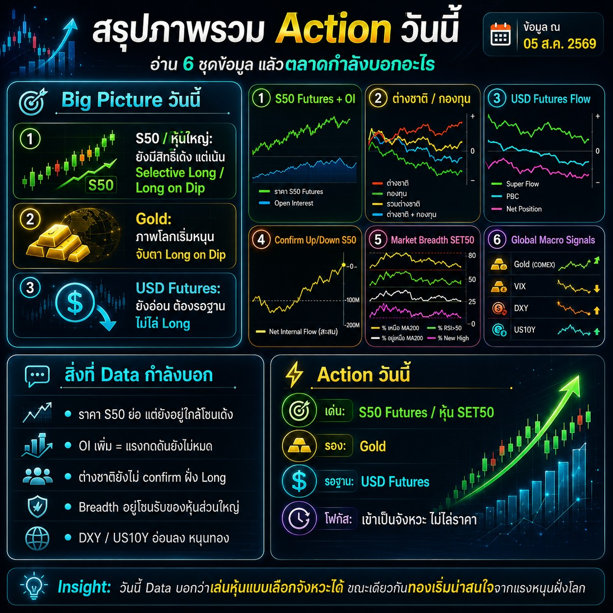

# Morning Brief

บทวิเคราะห์ตลาดก่อนเปิดทำการ ที่ผู้แนะนำการลงทุน (IC) ประกอบเสร็จภายในไม่กี่นาที
และลูกค้าเปิดอ่านเองได้จากลิงก์เดียว แทนการทำอินโฟกราฟิกด้วยมือแล้วส่งทางแชต

[**เปิดเว็บจริง**](https://morning-brief-dashboard-delta.vercel.app) ·
[สถาปัตยกรรม](docs/architecture.md) ·
[โมเดลสัญญาณ](docs/signal-model.md) ·
[คู่มือ IC Studio](docs/studio.md) ·
[การติดตั้งและ deploy](docs/deployment.md)



---

## ปัญหาที่แก้

ทีม IC ทำอินโฟกราฟิกเองทุกเช้า ใช้เวลานาน แก้ย้อนหลังไม่ได้ และเมื่อคนทำเปลี่ยน
สำนวนกับเกณฑ์การอ่านสัญญาณก็เปลี่ยนตาม ลูกค้าจึงได้บทวิเคราะห์ที่คุณภาพไม่คงที่

ระบบนี้แยก **ภาพจากระบบเทรด** ออกจาก **การจัดหน้าและการตีความ**

- IC แนบภาพ แล้วเลือกสัญญาณจาก dropdown ที่ตรงกับชีตที่ทีมใช้อยู่แล้ว
- ระบบให้คะแนน 0–100 ต่อข้อ ร่างข้อความให้ และคำนวณภาพรวมของวัน
- IC ตรวจและแก้คำได้ทุกช่อง แล้วกดเผยแพร่
- ทุกฉบับถูกบันทึกไว้วัดความแม่นย้อนหลังเทียบกับ SET50 จริง

## 6 สัญญาณที่ลูกค้าได้อ่าน

| # | หัวข้อ | คำถามที่ข้อนี้ตอบ |
|---|---|---|
| 1 | S50 Futures + Open Interest | คนในตลาดเปิดสถานะเพิ่ม หรือกำลังปิดออก |
| 2 | สะสม Long / Short ต่างชาติและกองทุน | เงินรายใหญ่กำลังซื้อหรือขาย |
| 3 | USD Futures Flow | ค่าเงินหนุนหรือกดดันหุ้นไทย |
| 4 | Confirm Up / Down S50 | แรงเงินยืนยันทิศทางราคาหรือไม่ |
| 5 | Market Breadth SET50 | หุ้นทั้งตลาดไปทางเดียวกับดัชนีไหม |
| 6 | Global Macro Signals | บรรยากาศตลาดโลกเป็นบวกหรือลบ |

ทุกข้อเล่าด้วยโครงเดียวกัน: **สรุปสั้น → แปลความ → Action วันนี้ → Insight**
พร้อมคะแนนของข้อนั้น และหน้าแรกรวมทั้ง 6 ข้อเป็นคะแนนภาพรวมของวัน

## ความสามารถหลัก

- **IC Studio** — เครื่องมือหลังบ้านแบบ 3 ขั้น (ใส่ภาพ → เลือกสัญญาณ → ตรวจและแก้คำ)
  มีพรีวิวสิ่งที่ลูกค้าจะเห็นแบบสด บันทึกร่างอัตโนมัติ ย้อนกลับได้ และกั้นด้วยรหัสผ่าน
- **โมเดลสัญญาณ** — กติกาให้คะแนนเขียนไว้ที่เดียวและมีเลขเวอร์ชัน ทีมแก้เกณฑ์ได้โดยไม่ต้องแก้หน้าเว็บ
  ([รายละเอียด](docs/signal-model.md))
- **รู้ช่วงย้ายสัญญา** — ระบบนับวันหมดอายุของ series เอง ช่วงใกล้หมดอายุจะเตือนว่า
  OI ที่ลดลงมาจากการย้ายสัญญา และเปลี่ยนไปอ่าน OI รวมทุก series แทน
- **คำของทีม** — แก้สำนวนแล้วบันทึกเป็นคำมาตรฐานของทีม ครั้งถัดไปที่เจอสถานการณ์เดิมจะได้คำชุดนั้นทันที
- **วัดความแม่นย้อนหลัง** — ทุกฉบับที่เผยแพร่ถูกบันทึกพร้อมเวอร์ชันกติกา แล้วเทียบกับราคาปิด SET50
  ที่ระบบจดอัตโนมัติทุกวันทำการ ดูสถิติได้ที่ `/studio/log` และดาวน์โหลดเป็น CSV ได้
- **รูปส่งลูกค้า** — สร้างภาพสรุปรายข้อไว้ส่งทางแชตได้จากหน้าเดียวกัน

## เริ่มพัฒนา

```bash
cd web
npm install
npm run dev
```

เปิด <http://localhost:3000> · ในโหมด dev เข้า `/studio` ได้เลยโดยไม่ต้องใส่รหัส

| คำสั่ง | ทำอะไร |
|---|---|
| `npm run dev` | รันเซิร์ฟเวอร์สำหรับพัฒนา |
| `npm run build` | build สำหรับ production |
| `npm run lint` | ตรวจโค้ดด้วย ESLint |
| `npm run fetch:macro` | ดึงราคา Gold / VIX / DXY / US10Y มาเก็บเป็น snapshot |

ทุก push และ pull request จะถูกตรวจด้วย type check, ESLint และ build อัตโนมัติ
([CI](.github/workflows/ci.yml))

## โครงสร้าง repo

```
docs/                      เอกสารทั้งหมด + ภาพตัวอย่าง input/output
web/                       แอป Next.js (ตั้ง Root Directory เป็นโฟลเดอร์นี้ตอน deploy)
  src/app/(dash)/          หน้าลูกค้า — สรุปภาพรวมและ 6 section
  src/app/(dash)/studio/   IC Studio และหน้าความแม่นย้อนหลัง (กั้นด้วยรหัสผ่าน)
  src/app/api/             เผยแพร่, คำของทีม, cron จดราคาปิด
  src/components/          shell (เมนู) · studio (เครื่องมือ IC) · ui (ที่ลูกค้าเห็น) · charts
  src/lib/                 โมเดลสัญญาณ, การให้คะแนน, ปฏิทินสัญญา, ชั้นข้อมูล, สิทธิ์เข้าถึง
  src/data/                brief ตั้งต้นและฉบับที่เผยแพร่ล่าสุด
  supabase/schema.sql      โครงตารางและถังเก็บภาพ
```

ไฟล์สำคัญที่สุดคือ [`web/src/lib/signal-forms.ts`](web/src/lib/signal-forms.ts)
(dropdown และกติกาให้คะแนนของทุกข้อ) และ [`web/src/lib/scenarios.ts`](web/src/lib/scenarios.ts)
(คลังคำที่ระบบเขียนให้ลูกค้า)

## Tech stack

Next.js 16 (App Router) · React 19 · TypeScript · Tailwind CSS v4 · Recharts · Motion ·
Supabase (ทางเลือก) · Vercel

## เอกสาร

| เอกสาร | เนื้อหา |
|---|---|
| [docs/architecture.md](docs/architecture.md) | โครงระบบ เส้นทางข้อมูล และเหตุผลเบื้องหลังการตัดสินใจ |
| [docs/signal-model.md](docs/signal-model.md) | กติกาให้คะแนนครบทุกข้อ พร้อมตัวอย่างและวิธีแก้เกณฑ์ |
| [docs/studio.md](docs/studio.md) | คู่มือใช้งานสำหรับทีม IC |
| [docs/deployment.md](docs/deployment.md) | ตัวแปรสภาพแวดล้อม, Supabase, cron, การ deploy |
| [CONTRIBUTING.md](CONTRIBUTING.md) | วิธีทำงานกับโค้ด แนวทาง commit และ PR |
| [SECURITY.md](SECURITY.md) | การแจ้งช่องโหว่และข้อควรระวังเรื่องความลับ |
| [CHANGELOG.md](CHANGELOG.md) | สรุปสิ่งที่เปลี่ยนในแต่ละรอบ |

## สถานะข้อมูลบนเว็บสาธิต

ตัวเลขบางส่วนบนเว็บสาธิตยังเป็นข้อมูลจำลอง และมีป้ายกำกับไว้บนหน้าเว็บ
มีเพียงข้อ 6 Global Macro ที่เป็นราคาจริง ส่วนข้อ 1 และ 2 ใช้ข้อมูลจริงจากชีตของทีมเมื่อ IC นำเข้า

## ลิขสิทธิ์

สงวนลิขสิทธิ์ · ดู [LICENSE](LICENSE)
